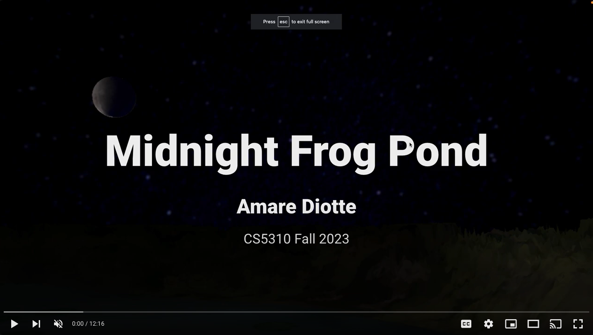
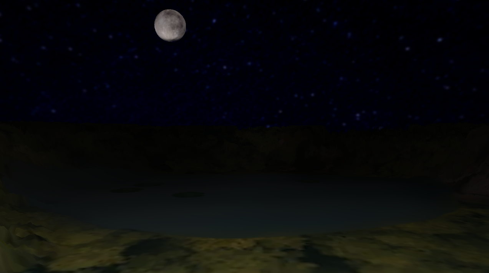
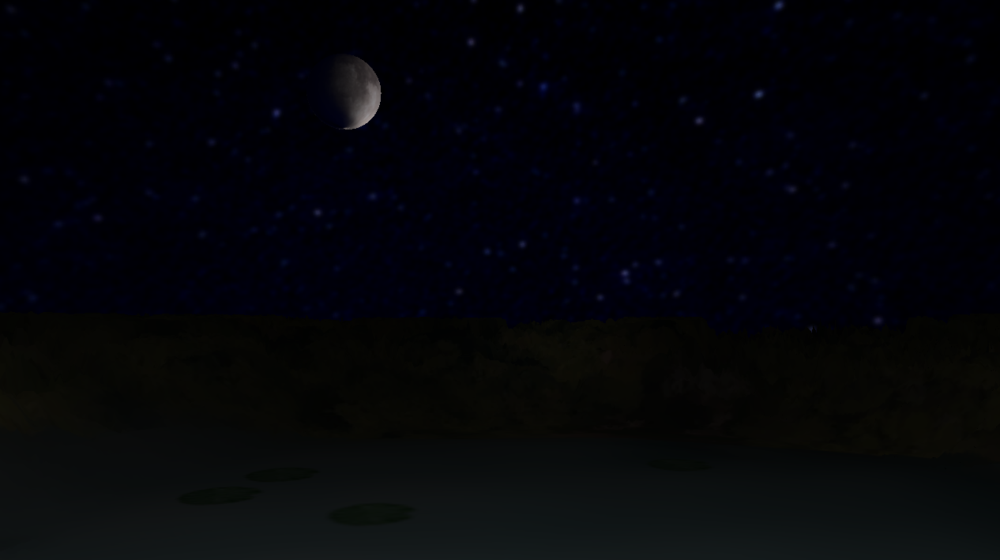
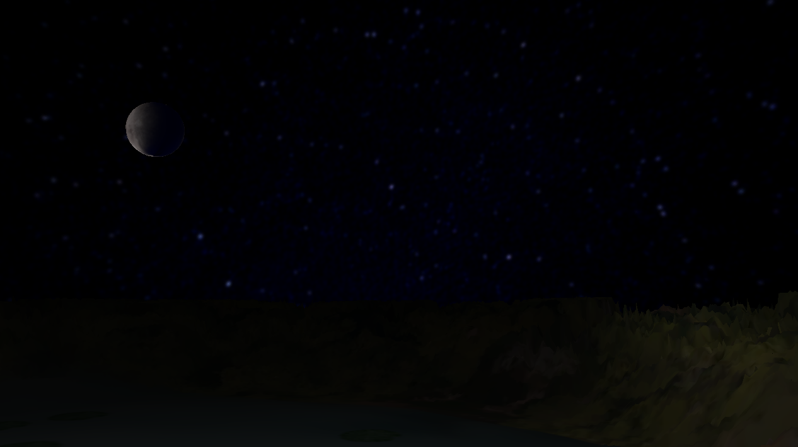
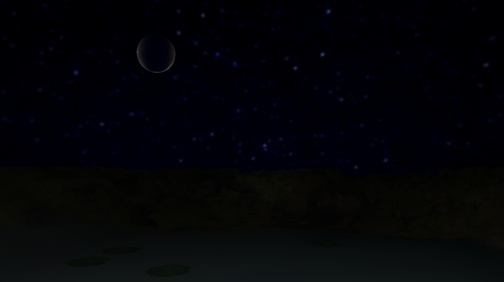

## "Midnight Frog Pond"
### Simple Object and Texture Loader


This is the final project I completed in my Master's program. This is the final project for an interactive computer graphics class that uses OpenGL to render a 3D scene of a frog pond at night. The program is built from source code for different components that the professor supplied over the course of the semester. It also uses some source code from <a href="https://learnopengl.com/">Learn OpenGL</a>, another great resource. My goal involved combining these parts into a unified program that could be expanded on in the future while fully grasping their roles in the overall graphics pipeline. Throughout the semester, I gained insights into OpenGL's rendering pipeline and design patterns that made programming more complicated scenes feasible. 

For my project, I prioritized constructing a flexible program architecture for scalability and easy abstraction. Although I initially wanted to create intricate scenes, time constraints prompted me to limit myself to basic shapes such as quads and spheres for this first iteration. To enhance the visual appeal of the scene with these basic geometries, I applied graphic design skills. I curated high-resolution images, edited them in Photoshop and Gimp, and added custom textures.

Implementing the factory design method facilitated adding new objects to the scene - text inputs are used to dynamically determine each entity's geometry, texture, and behavior on the screen. This project deepened my understanding of OpenGL, design patterns, and graphics programming, establishing a foundation for future explorations in Blender and OpenGL.


## Presentation
(Same video, just different uploads):

<div align="left">
      <a href="https://www.youtube.com/watch?v=H7zUugNJhbQ">
         
      </a>
</div>

**Dropbox**
https://www.dropbox.com/scl/fi/18mtaatonjpu3tgm90tt5/FinalProject.mov?rlkey=9xerygracs96t06pxtb6jvtcc&dl=0

## Screenshots:

<caption>Initial view</caption>


<caption>View from right side</caption>


<caption>Eclipse - partial </caption>


<caption>Eclipse - full </caption>


## Compilation notes

if you are on a Mac and have compilation issues, replace line 25 in the build.py file with:

```

LIBRARIES="-F/Library/Frameworks -framework SDL2"

```
<br>

Also, any objects that use SDL.h probably need this heading added back in:
```
  #if defined(LINUX) || defined(MINGW)

  #include <SDL2/SDL.h>
      
  #else // This works for Mac

  #include <SDL.h>
      
  #endif
```
<br>

### Link to presentation slides:

https://docs.google.com/presentation/d/1OHy2vmyjO4PRNmW5abiy40k0O-cTpNV9b4hBV8KIlXc/edit?usp=sharing

<br>

*Not the full video, just a quick clip of the program running:*

https://www.youtube.com/watch?v=uvwcN2KyraA


## Citations:
This program is based on source code created by <a href="https://www.mshah.io/"> Mike Shah</a> for <a href="https://www.mshah.io/comp/Fall23/Graphics/public/index.php"> CS5310 Computer Graphics </a> at Northeastern. More information about his source code can be found <a href="https://www.youtube.com/embed/videoseries?list=PLvv0ScY6vfd_GH4r13ylnbxF-IXKP7VuL">here</a>.

Some code is also based on lessons from :
https://learnopengl.com/

Raw images used for scene obtained from:
- https://upload.wikimedia.org/wikipedia/commons/3/37/Aerial_view_of_Lagoa_do_Can%C3%A1rio%2C_S%C3%A3o_Miguel_Island%2C_Azores%2C_Portugal_%28PPL1-Corrected%29.jpg
- https://wallpapers.com/wallpapers/starry-sky-night-dark-sky-stars-zeyj6p1s41agbk57.html
- https://upload.wikimedia.org/wikipedia/commons/2/2d/Full_Moon_%2815984763045%29.jpg


Tutorials used for "fog" effect:
- https://www.youtube.com/watch?v=oQksg57qsRA&t=19s
- https://www.youtube.com/watch?v=qslBNLeSPUc


  